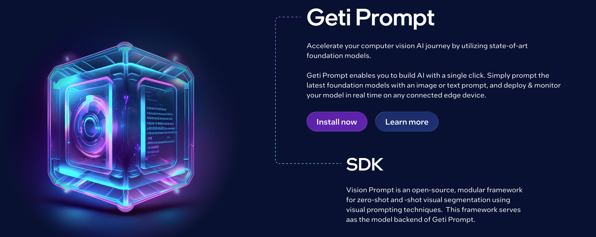
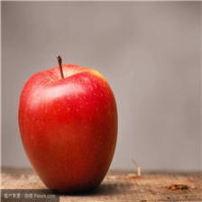
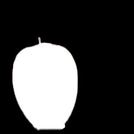
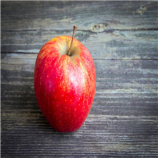

[]()
[](LICENSE)

</div>

# 👋 Geti-Prompt

A production-ready platform for Visual Prompting on live video streams.

Geti Prompt bridges the gap between research and production. It is a comprehensive platform that enables users to explore, develop, and deploy visual prompting algorithms. Whether you are experimenting with new foundation models or deploying them for real-time inference, Geti Prompt provides a modular architecture extensible to various streaming sources, designed to support inputs such as IP cameras and GenICams.

<p align="center">
 <image src="https://github.com/user-attachments/assets/de1b0c30-893d-4d6e-bcdd-818228ab1238" width="1200"/>
</p>

## 💡 What is Visual Prompting?

Visual prompting offers a powerful alternative to traditional training. Instead of curating thousands of labeled images, you simply show the model one or a few examples of what you are looking for. The model effectively "learns" instantly, detecting and segmenting similar objects in new images or live video streams without retraining.

## 🛫 Getting Started

Geti Prompt can be used in two ways: as a **Python library** for research and algorithmic development, or as a **Full Application** for visual prompting with a user interface.


### Geti Prompt Library

Install the library with `uv`:

```bash
cd library

# With CUDA support (recommended for GPU)
uv sync --extra gpu

# CPU only
uv sync --extra cpu

# Intel XPU
uv sync --extra xpu
```

<p align="center">
  
  
  
</p>
<p align="center"><i>Reference image → Reference mask → Target image</i></p>

**Step 1: Generate a reference mask using SAM**

```python
import torch
from getiprompt.components.sam import PyTorchSAMPredictor
from getiprompt.utils.constants import SAMModelName
from getiprompt.data.utils import read_image

# Load reference image
ref_image = read_image("library/tests/assets/fss-1000/images/apple/1.jpg")

# Initialize SAM predictor (auto-downloads weights)
predictor = PyTorchSAMPredictor(SAMModelName.SAM_HQ_TINY, device="cuda")

# Set image and generate mask from a point click
predictor.set_image(ref_image)
ref_mask, _, _ = predictor.predict(
    point_coords=torch.tensor([[[51, 150]]], device="cuda"),  # Click on apple
    point_labels=torch.tensor([[1]], device="cuda"),           # 1 = foreground
    multimask_output=False,
)
```

**Step 2: Fit and predict with Matcher**

```python
from getiprompt.models import Matcher
from getiprompt.data import Batch, Sample
from getiprompt.data.utils import read_image

# Initialize Matcher
model = Matcher(device="cuda")

# Create reference sample with the generated mask
ref_sample = Sample(
    image=ref_image,
    masks=ref_mask[0],
    categories=["apple"],
    category_ids=[0],
)

# Fit on reference
model.fit(Batch.collate([ref_sample]))

# Predict on target image
target_image = read_image("library/tests/assets/fss-1000/images/apple/2.jpg")
target_sample = Sample(image=target_image)
predictions = model.predict(Batch.collate([target_sample]))

# Access results
masks = predictions[0]["pred_masks"]   # Predicted segmentation masks
```

> 📘 For detailed documentation, CLI usage, and benchmarking, see the [Library README](library/README.md).

### Geti Prompt Application
<TBD>

## 🧮 Supported models

Geti Prompt supports a variety of foundation models and visual prompting algorithms, optimized for different performance needs.

### Foundation Models (Backbones)

| Family | Models | Description | Paper | Repository |
|--------|--------|-------------|-------|------------|
| **SAM** | SAM-HQ, SAM-HQ-tiny | High-quality variants of the original Segment Anything Model. | [Segment Anything](https://arxiv.org/abs/2304.02643), [SAM-HQ](https://arxiv.org/abs/2306.01567) | [SAM](https://github.com/facebookresearch/segment-anything), [SAM-HQ](https://github.com/SysCV/sam-hq) |
| **SAM 2** | SAM2-tiny, SAM2-small, SAM2-base, SAM2-large | The next generation of Segment Anything, offering improved performance and speed. | [SAM 2](https://arxiv.org/abs/2408.00714) | [sam2](https://github.com/facebookresearch/sam2) |
| **SAM 3** | SAM 3 | Segment Anything with Concepts, supporting open-vocabulary prompts. | [SAM 3](https://arxiv.org/abs/2511.16719) | [SAM 3](https://github.com/facebookresearch/sam3) |
| **MobileSAM** | MobileSAM | Lightweight SAM for mobile applications. | [MobileSAM](https://arxiv.org/abs/2306.14289) | [MobileSAM](https://github.com/ChaoningZhang/MobileSAM) |
| **EfficientViT** | EfficientViT-SAM | Accelerated SAM without accuracy loss. | [EfficientViT-SAM](https://arxiv.org/abs/2402.05008) | [EfficientViT](https://github.com/mit-han-lab/efficientvit) |
| **DINOv2** | Small, Base, Large, Giant | Self-supervised vision transformers with registers, used for feature extraction. | [DINOv2](https://arxiv.org/abs/2304.07193), [Registers](https://arxiv.org/abs/2309.16588) | [dinov2](https://github.com/facebookresearch/dinov2) |
| **DINOv3** | Small, Small+, Base, Large, Huge | The latest iteration of DINO models. | [DINOv3](https://arxiv.org/abs/2508.10104) | [dinov3](https://github.com/facebookresearch/dinov3) |
| **Grounding DINO** | (Integrated in GroundedSAM) | Open-set object detection model. | [Grounding DINO](https://arxiv.org/abs/2303.05499) | [GroundingDINO](https://github.com/IDEA-Research/GroundingDINO) |

### Visual Prompting Algorithms

| Algorithm | Description | Paper | Repository |
|-----------|-------------|-------|------------|
| **Matcher** | Standard feature matching pipeline using SAM. | [Matcher](https://arxiv.org/abs/2305.13310) | [Matcher](https://github.com/aim-uofa/Matcher) |
| **SoftMatcher** | Enhanced matching pipeline with soft feature comparison, inspired by Optimal Transport. | [IJCAI 2024](https://www.ijcai.org/proceedings/2024/1000.pdf) | N/A |
| **PerDino** | Personalized DINO-based prompting, leveraging DINOv2/v3 features for robust matching. | [PerSAM](https://arxiv.org/abs/2305.03048) | [Personalize-SAM](https://github.com/ZrrSkywalker/Personalize-SAM) |
| **GroundedSAM** | Combines Grounding DINO and SAM for text-based visual prompting and segmentation. | [Grounding DINO](https://arxiv.org/abs/2303.05499), [SAM](https://arxiv.org/abs/2304.02643) | [GroundedSAM](https://github.com/IDEA-Research/Grounded-Segment-Anything) |

## 🎡 Community

- To report a bug or submit a feature request, please open a [GitHub issue](https://github.com/open-edge-platform/geti-prompt/issues).

## 🙌 Contributing

We welcome contributions! Check out our [Contributing Guide](CONTRIBUTING.md) to get started.

## Acknowledgements
This project incorporates code from several open-source repositories. We thank the authors for their contributions. A complete list of third-party software is available in the [third-party-programs.txt](third-party-programs.txt) file.


## 📝 License

Geti Prompt is licensed under the [Apache License 2.0](LICENSE).

FFmpeg is an open source project licensed under LGPL and GPL. See https://www.ffmpeg.org/legal.html. You are solely responsible for determining if your use of FFmpeg requires any additional licenses. Intel is not responsible for obtaining any such licenses, nor liable for any licensing fees due, in connection with your use of FFmpeg.
