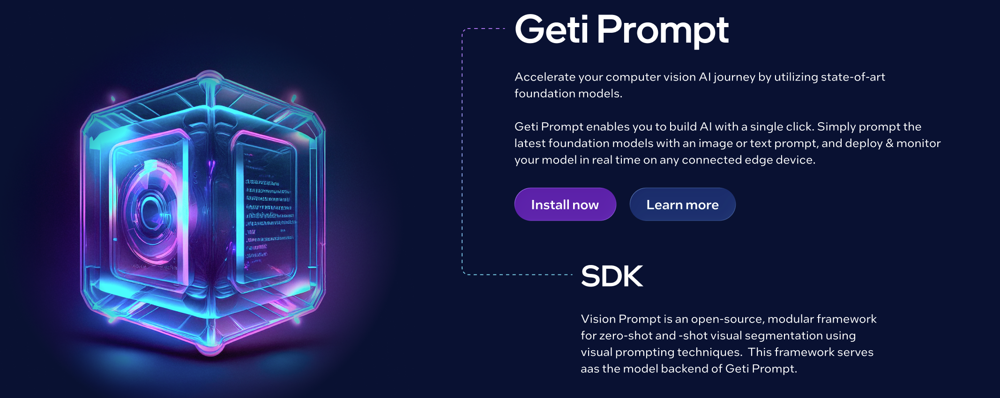
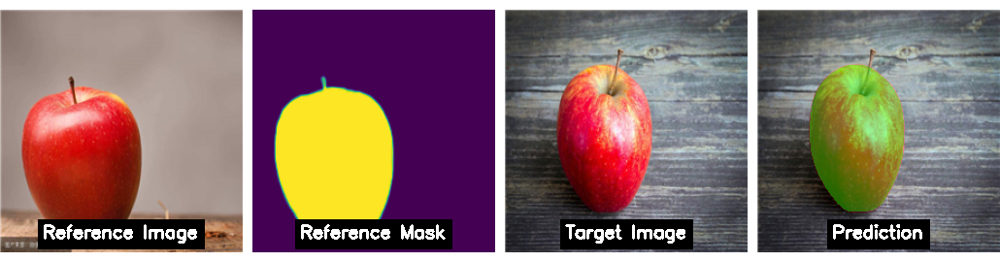

<!-- markdownlint-disable MD013 MD033 MD041 MD042 -->
<div align="center">



**A framework for developing, benchmarking, and deploying zero-shot visual prompting algorithms on the edge.**

[]()
[](LICENSE)
</div>

# Introduction

Visual prompting offers a powerful alternative to traditional training. Instead of curating thousands of labeled images, you simply show the model one or a few examples of what you are looking for. The model effectively "learns" instantly, detecting and segmenting similar objects in new images or live video streams without retraining.

<p align="center">
 <image src="https://github.com/user-attachments/assets/9ccc585d-6590-4e54-b766-d95bdccf725d" width="1200"/>
</p>

## Key Features

- **Library & Application**: A unified framework providing a **modular Python library** for research and development, and a **Full-Stack Application** for deploying those algorithms on live video streams.
- **Simple & Modular API**: A composable design where developers can mix and match components (backbones, matchers) to create custom pipelines.
- **Algorithms & Models**: A wide collection of ready-to-use zero-shot and few-shot algorithms (e.g., **SAM 2**, **Matcher**, **GroundedSAM**) and foundation models.
- **Hardware Acceleration**: Built-in support for model optimization and export to [**OpenVINO™**](https://www.intel.com/content/www/us/en/developer/tools/openvino-toolkit/overview.html) for fast inference on Intel hardware (CPU, GPU, NPU).
- **Multiple Backends**: Seamless switching between **PyTorch** for flexibility/research and **OpenVINO** for optimized deployment.

## Getting Started

Geti Prompt consists of two core components:

- **Python Library**: The foundation for research and zero/few shots algorithm development.
- **Full Stack Application**: Leverages the library to enable real-time inference on live streams, video files, and images.

<details>
<summary> Prerequisites </summary>

- **Python 3.12+**
- **[uv](https://github.com/astral-sh/uv)** (Python package manager)
- **[Just](https://github.com/casey/just)** (Command runner)
- **Node.js (v24.2.0)** (Required only for the UI Application)
- **Docker** (Optional, for containerized deployment)

</details>

### Geti Prompt Library

Install the library:

```bash
cd library
uv sync --extra xpu    # Intel XPU (recommended)
uv sync --extra cpu    # CPU only
uv sync --extra gpu    # CUDA support
```

Or with pip:

```bash
pip install ./library[xpu]  # or [cpu], [gpu]
```

<p align="center">
  
</p>

```python
from getiprompt.models import Matcher
from getiprompt.data import Sample

# Initialize Matcher (device: "xpu", "cuda", or "cpu")
model = Matcher(device="xpu")

# Create reference sample (auto-loads image and mask from paths)
ref_sample = Sample(
    image_path="library/examples/assets/coco/000000286874.jpg",
    mask_paths="library/examples/assets/coco/000000286874_mask.png",
)

# Fit on reference
model.fit(ref_sample)

# Predict on target image
target_sample = Sample(image_path="library/examples/assets/coco/000000390341.jpg")
predictions = model.predict(target_sample)

# Access results
masks = predictions[0]["pred_masks"]  # Predicted segmentation masks
```

> For interactive mask generation with SAM, CLI usage, and benchmarking, see the [Library README](library/README.md).

### Geti Prompt Application

**Full-stack web interface for real-time inference.**

Deploy models on live video streams, cameras, and video files.

```bash
just application/dev
```

Access at: http://localhost:3000

[View Application Documentation →](application/README.md)

## Supported Models and Algorithms

Geti Prompt supports a variety of foundation models and visual prompting algorithms, optimized for different performance needs.

### Visual Prompting Algorithms

| Algorithm | Description | Paper | Repository |
| --------- | ----------- | ----- | ---------- |
| **Matcher** | Standard feature matching pipeline using SAM. | [Matcher](https://arxiv.org/abs/2305.13310) | [Matcher](https://github.com/aim-uofa/Matcher) |
| **SoftMatcher** | Enhanced matching pipeline with soft feature comparison, inspired by Optimal Transport. | [IJCAI 2024](https://www.ijcai.org/proceedings/2024/1000.pdf) | N/A |
| **PerDino** | Personalized DINO-based prompting, leveraging DINOv2/v3 features for robust matching. | [PerSAM](https://arxiv.org/abs/2305.03048) | [Personalize-SAM](https://github.com/ZrrSkywalker/Personalize-SAM) |
| **GroundedSAM** | Combines Grounding DINO and SAM for text-based visual prompting and segmentation. | [Grounding DINO](https://arxiv.org/abs/2303.05499), [SAM](https://arxiv.org/abs/2304.02643) | [GroundedSAM](https://github.com/IDEA-Research/Grounded-Segment-Anything) |
| **SAM 3** | Open-vocabulary segmentation using concept-based prompts. | [SAM 3](https://arxiv.org/abs/2511.16719) | [SAM 3](https://github.com/facebookresearch/sam3) |

### Foundation Models (Backbones)

| Family | Models | Description | Paper | Repository |
| ------ | ------ | ----------- | ----- | ---------- |
| **SAM** | SAM-HQ, SAM-HQ-tiny | High-quality variants of the original Segment Anything Model. | [Segment Anything](https://arxiv.org/abs/2304.02643), [SAM-HQ](https://arxiv.org/abs/2306.01567) | [SAM](https://github.com/facebookresearch/segment-anything), [SAM-HQ](https://github.com/SysCV/sam-hq) |
| **SAM 2** | SAM2-tiny, SAM2-small, SAM2-base, SAM2-large | The next generation of Segment Anything, offering improved performance and speed. | [SAM 2](https://arxiv.org/abs/2408.00714) | [sam2](https://github.com/facebookresearch/sam2) |
| **SAM 3** | SAM 3 | Segment Anything with Concepts, supporting open-vocabulary prompts. | [SAM 3](https://arxiv.org/abs/2511.16719) | [SAM 3](https://github.com/facebookresearch/sam3) |
| **DINOv2** | Small, Base, Large, Giant | Self-supervised vision transformers with registers, used for feature extraction. | [DINOv2](https://arxiv.org/abs/2304.07193), [Registers](https://arxiv.org/abs/2309.16588) | [dinov2](https://github.com/facebookresearch/dinov2) |
| **DINOv3** | Small, Small+, Base, Large, Huge | The latest iteration of DINO models. | [DINOv3](https://arxiv.org/abs/2508.10104) | [dinov3](https://github.com/facebookresearch/dinov3) |
| **Grounding DINO** | (Integrated in GroundedSAM) | Open-set object detection model. | [Grounding DINO](https://arxiv.org/abs/2303.05499) | [GroundingDINO](https://github.com/IDEA-Research/GroundingDINO) |

## Documentation

| Component | README | Documentation |
|-----------|--------|---------------|
| **Library** | [library/README.md](library/README.md) | [library/docs](library/docs/) |
| **Application** | [application/README.md](application/README.md) | [application/docs](application/docs/) |

## Community

- To report a bug or submit a feature request, please open a [GitHub issue](https://github.com/open-edge-platform/geti-prompt/issues).
- Ask questions via [GitHub Discussions](https://github.com/open-edge-platform/geti/discussions).

## License

Geti Prompt is licensed under the [Apache License 2.0](LICENSE).

FFmpeg is an open source project licensed under LGPL and GPL. See <https://www.ffmpeg.org/legal.html>. You are solely responsible for determining if your use of FFmpeg requires any additional licenses. Intel is not responsible for obtaining any such licenses, nor liable for any licensing fees due, in connection with your use of FFmpeg.
