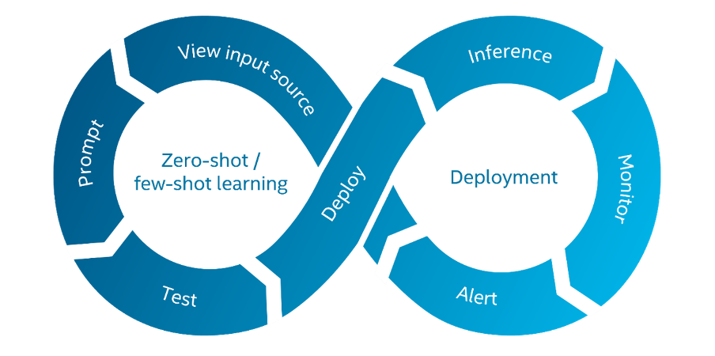

# Introduction

## What is Geti Prompt

Geti Prompt empowers edge users, ranging from domain experts to developers and data scientists, to build computer vision models with a single click.

This open-source Python application facilitates users to prompt, run and manage configurable zero-shot/few-shot AI pipelines. Geti Prompt can simply be installed and used as a desktop application or deployed as a Docker image directly at the edge.

Geti Prompt is part of the Geti Apps ecosystem and comes with its own VisionPrompt model framework. This open-source, modular framework facilitates easy experimentation with different state-of-the-art algorithms, backbones like SAM and Dino family models, and pipeline components.

1. **View input source** – After installing Geti Prompt, users can directly connect a data source of choice, including usb camera, a watched folder with video and image files, to the application via its UI.
2. **Prompt** – Geti Prompt offers two ways for users to prompt a model: using a visual prompt on one or few reference images that can be captured from the input source, or a text prompt.
3. **Test** – Geti Prompt processes the provided prompt against the visual input stream for immediate evaluation. The user can edit or add prompts at any time to adjust the model output.
4. **Deploy** – Once the prompted model meets the user’s performance requirements, the user can deploy the Geti Prompt application, including the prompted model, in different ways: as a containerized Docker image for deployment on remote edge servers and devices, or run the application & model directly on a local pc.
5. **Inference** – The user can configure how the model output will be consumed. The user can set a destination of choice, e.g. publishing the results to a message bus.
6. **Alert** – The generated output from the deployed model can be consumed by custom business logic flows built by users, so that action can be taken upon the inference results in an automated way, for example by using Node-RED.
